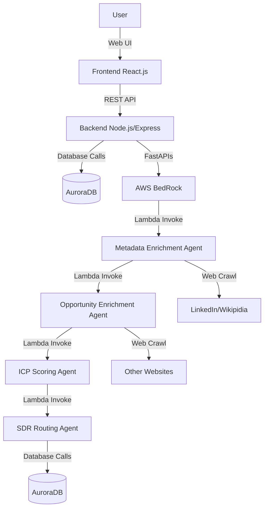
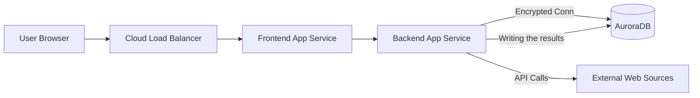
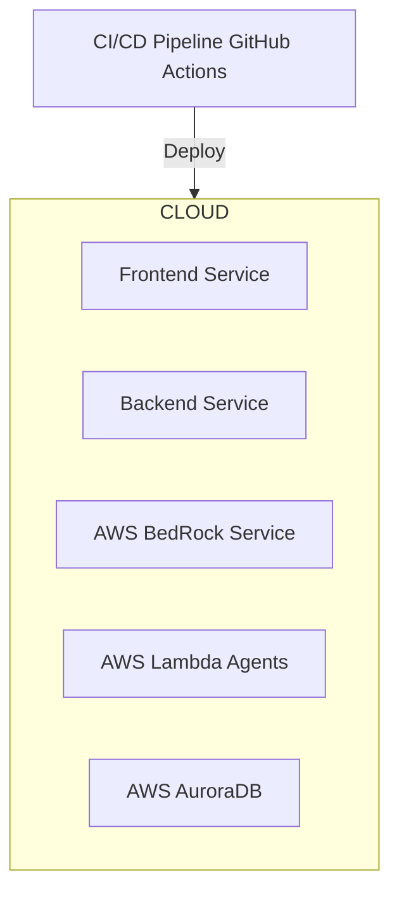

# AgentX Hackathon - Architecture Overview

## 1. Introduction

This document describes the architectural design for the "LeadGenRich" project. It outlines a modern serverless architecture that leverages AI agents orchestrated via AWS BedRock and AWS Lambda to automate and enhance the Sales Development Representative (SDR) lead enrichment and routing process.
Please find the architecture image at following link 
https://amedeloitte-my.sharepoint.com/:i:/r/personal/asprajapati_deloitte_com/Documents/AgentX%20Hackathon/architecture.jpg?csf=1&web=1&e=uOGrfw

---

## 2. Logical Architecture

- **Frontend:** Built with React.js, provides the user interface for inputting leads and viewing results.
- **Backend:** Node.js/Express application that handles user requests, orchestrates the workflow, and manages data flow.
- **Database:** AWS AuroraDB (Relational Database Service) used for storing application data, enriched lead information, and configuration settings.
- **AWS BedRock:** Orchestration layer for managing and invoking the various AI agents (Lambda functions) defined below.
- **Metadata Enrichment Agent :** A serverless Lambda function that initiates the enrichment process by crawling high-level sources.
- **Opportunity Enrichment Agent :** A serverless Lambda function that deepens the lead profile by crawling specific websites.
- **ICP Scoring Agent :** A serverless Lambda function that scores the enriched lead against the Ideal Customer Profile criteria.
- **SDR Routing Agent :** A serverless Lambda function that determines the appropriate Sales Development Representative based on the lead's score and attributes, and updates the database.
  
---

## 3. Physical Architecture

- **Cloud Load Balancer:** Distributes requests to frontend app servers.
- **Frontend/Backend App Services:** Deployed as managed containers/services (e.g., AWS ECS/EKS, Azure App Service, GCP Cloud Run).
- **AuroraDB:** A managed, highly available relational database instance hosted within a secure private subnet.
- **External Web Sources:** Represents LinkedIn, Wikipedia, and other websites accessed by the backend/agents during the enrichment phase.

---

## 4. Deployment Architecture

- **CI/CD Pipeline:** GitHub Actions automates build, test, and deployment steps.
- **Cloud Provider:** The entire infrastructure is hosted on AWS.
- **Frontend/Backend Services:** Frontend is likely deployed via AWS Amplify/S3, and the backend as a containerized service (AWS ECS/Fargate).
- **AWS BedRock Service: :**  A managed AWS service integrated into the deployment for agent orchestration.
- **AWS Lambda Agents:** Serverless functions deployed via the pipeline, triggered by BedRock/Backend.
- **AWS AuroraDB:** The managed database instance (RDS Aurora).

---

## 5. Cloud Components Used / Planned

| Component | Cloud Provider | Purpose |
|-----------|---------------|---------|
| App Service / Compute | AWS ECS/Fargate, AWS Amplify | App hosting |
| Serverless Compute |	AWS Lambda | Hosting Agents |
| AI Orchestration |	AWS BedRock | Agent workflow orchestration |
| Database |	AWS AuroraDB (RDS) | Persistent storage  |
| Load Balancer |	AWS ALB | Traffic distribution |
| Cloud Functions | AWS Lambda, Azure Functions | Serverless workloads |
| Monitoring | AWS CloudWatch, Azure Monitor | Observability |

---

## 6. Additional Notes

- Architecture Style: Primarily an event-driven, serverless microservices architecture utilizing AWS BedRock agents.
- All backend services and agents are designed to be stateless where possible to facilitate easy scaling.
- Security: IAM roles are strictly enforced between services (Backend <-> BedRock <-> Lambda <-> AuroraDB) to ensure least privilege access.
- Infrastructure as Code (IaC) planned using AWS CloudFormation or Terraform.

---
